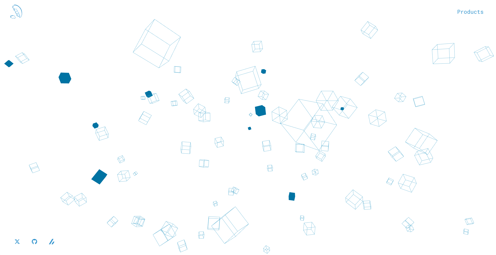

# [Suu's Portfolio](https://portfolio-c7p.pages.dev)

## 使用技術

- React
- Typescript
- Vite
- react three（立方体の描画）
- ChakraUI（モーダルの表示）
- CloudFlare（デプロイ）

### ちょっとしたこだわり

- スマホ対応
  - 横幅が一定より狭くなると立方体の表示数が少なくなるようにしています
- 立方体のクリック
  - 濃い青の立方体はクリックすると消えるようにしています
  - ぜひ、エイム練習に使ってみてください
